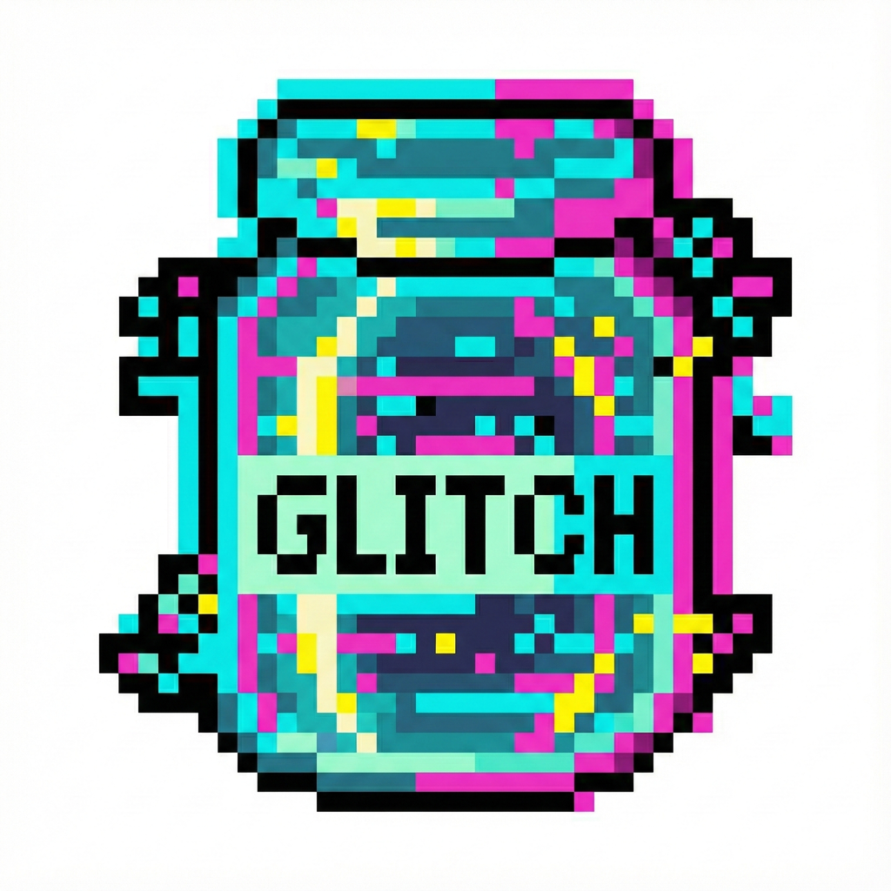

  

  # G̶L̷I̶T̷C̴H̶-̶J̸A̴R̵

  **Capturing the chaos of Real-time AI. ⚡️**

  

    
    
    
  

  ---

  ### "T̶urning r̶eal-time n̶oise i̶nto i̶ntelligent s̶ignals."
   

## ⚡️ Who are we?

**Glitch-Jar** is an engineering lab focused on the convergence of **WebRTC** and **Generative AI**.

Real-time data streams are often unpredictable and chaotic—like glitches in the system. Our mission is to capture, process, and understand these streams using **Go (Gopher)**. We build robust pipelines that fuse **Vision (Eyes)** and **Language (BabelGohper)** to create seamless multimodal experiences.

We are serious about performance, concurrency, and the frontier of AI infrastructure.

---

## 🧪 Core Projects (The Specimens)

Cutting-edge experiments contained within our jar.

| Project | Codename | Complexity | Description |
| :--- | :---: | :---: | :--- |
| **🗣️ Language** | **`BabelGopher`** | 🔥 **High** | **WebRTC + LLM Pipeline.** A low-latency speech-to-speech translation engine. Breaking language barriers in real-time. |
| **👁️ Vision** | **`LLM Eyes`** | ⚡ **Mid** | **Real-time Perception.** Empowering AI agents with visual understanding through continuous video streams. |
| **🐹 Infra** | **`Gopher-Stash`** | 🛡️ **Base** | **Go Toolkit.** High-performance utilities and libraries that power our multimodal architecture. |

---

## 🛠️ Tech Stack

  
  
  
  
  

---

## 📟 Transmission

> *"O̶rder f̶rom c̶haos. S̶ignal f̶rom n̶oise."*

 

  © 2025 Glitch-Jar. Building the future of real-time interaction.

